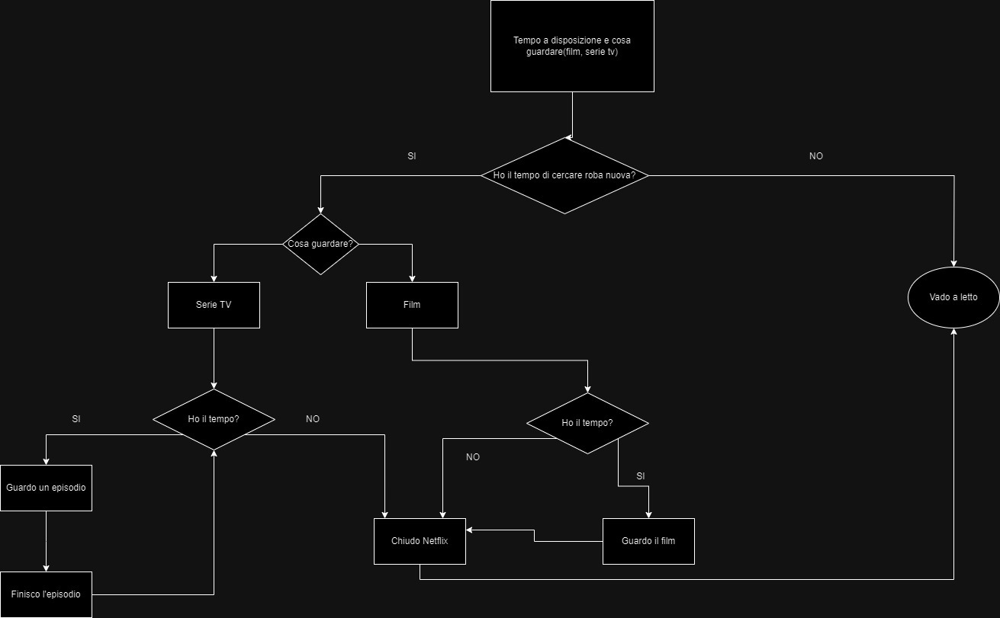

# Esercizio: crea un algoritmo

## Consegna:
#### Scegliere cosa guardare su Netflix:
Che barba, che noia, che noia, che barba!
Perché ci si mette sempre un’ora a scegliere cosa guardare la sera? Certo è difficile mettere d’accordo i gusti di tutti, poi dipende anche in base al tempo (o al sonno) che abbiamo. Delle volte si pensa di vedere quel bel film che ci hanno consigliato, mentre altre volte si viene risucchiati da quella serie tv che ci tiene incollati allo schermo. Che senso di vuoto quando poi finisce!

## Spiegazione del diagramma

L' algoritmo tiene in cosinderazione il tempo per cercare qualcosa da guardare di nuovo, ed il tempo per guardare quella serie o film. 
Se non si ha tempo di cercare qualcosa da guardare si va a letto e l' algoritmo finisce.
Se si ha tempo di cercare allora si decide se guardare una serie o film.
Se si sceglie la serie ci si chiede se si ha il tempo di guardarla, se no chiudo netflix e vado a letto quindi l' algoritmo finisce, se invece ho tempo guardo un episodio e all fine dell' episodio se ho tempo ne guarderò un altro.
Se scelgo il film mi chiedo sempre se ho il tempo di guardarlo, se si guarderò il film quando sarà finito chiuderò netflix e andrò a letto, se invece non ho tempo chiudo netflix e vado a letto fine algoritmo.

